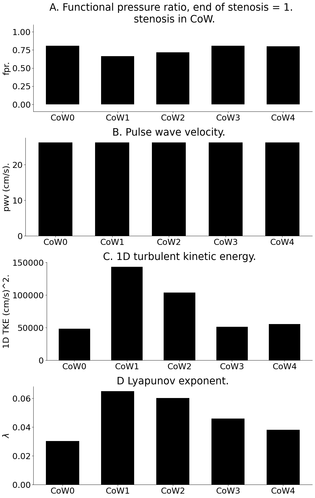

# Repository.

Human 1D hemodynamic modelling of effects of vasospasm.

# Background. 

Permenant or transient constrictions (stenosis or vasospasm) in the brain are deliteroius as well as difficult to diagnose. Each person has a different cerebral arteries architecture depending on the main collatral circulation, nominally called Circle of Willis variants. Ongoing experimental efforts in Western University and elsewhere have identified a need for CFD/FSI modelling.
This code attempts to address multiple relevant questions:  
* Can vasospam be detected in large vessel pressure signals.  
* Are vasospam related to underlying blood (fluid) turbulance.  
* Can a clinical metric similar to coronary FFR be prescribed for the brain.  
* Do CoW variants affect turbulance, pressure, and flow.  
* Are prevelant treatments such as 3H (increased heart rate, induced hypertension, or reduced hematocrit) as effective as we think.  

The initial part of this project was already complted by Tim (see repo: 12.WholeBody0D_JJTH_2022 ).

# Dependencies.

This repo has the same dependencies as the FFR repo. except that the coronary geometry is replaced by the human geometry. This repo also uses two Python libraries:  
* Time series analysis using Nolds in Python3+ (https://cschoel.github.io/nolds/).
* Custom written python code to calculate turbulent kinetic energy using definition.
* Fourier analysis using scipy's fft, ifft, and fftpack.

# Install.

Similar to coronary FFR.

# Description and use.

The human model is a large network as shown in the figure below.  

Inputs pressure conditions to this model were taken from the extensive study from a King's College London group (http://haemod.uk/original). The preprocessor (combination of matlab and python) generates terminal boundary conditions. It also 
generates the SWC form of the geometry as well as the input to the SV 1D solver, the "in script". An example of the SWC geometry is provided. A working 1D script is also provided which should work with the SimVascular 1D solver.  

The output is postprocessed for the metrics obtained in the repo #13 coronary model, and pulse wave velocity, functional pressure ratio, turbulant kinetic energy, and Lyapunov exponent at each location are also calculated. The codes were used to generate the figure below which demonstrates that the dynamical quantities (turbulant kinetic energy TKE, and maximum Lyapunov exponent lambda) are better related to the brain's blood vessel geometry (CoW variants) than the widely accepted PWV and FPR. The codes will be made opensource at an appropriate time.

All of the above is also processed as a data science project where multiple simulations provide the data for statistical data fitting that may eventually provide a desktop solution.

# Maintainer.

Dr. SR Kharche is the primary developer and maintainer of this model. 

# Provenance.

New releases will be made available to users under suitable agreement.

# Acknowledements.

This project was generously funded by CANARIE Inc. Canada (April 2020 to March 2023). 

# Licence.

This work is proprietary and may not be used or distributed unless a formal agreement has been reached.

## Dr. Sanjay R. Kharche, Ph.D. (App. Maths).  

January 23rd, 2023.  
Email: Sanjay.Kharche@lhsc.on.ca , skharche@uwo.ca , srk.london@yahoo.com .  
Phone: +15198780685 (mobile).  
Website: https://kcru.lawsonresearch.ca/research/srk/index.html  

